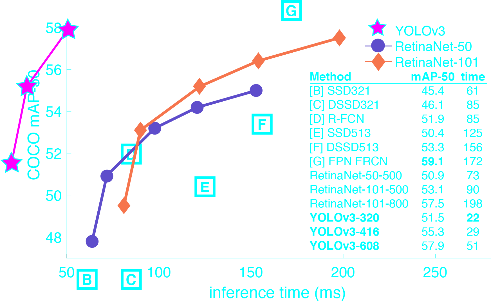

# Gun Detection with YOLOv3
My Computer Science Engineering Final Year Project 

Download the weight file from my <a href="https://drive.google.com/file/d/1WjHpBckxkt4DEJCbe8fmly-FZuax5KWw/view?usp=sharing">Google drive Repo</a>  link before running this code
 

## .........................................................................
# YOLO: Real-Time Object Detection:

You only look once (YOLO) is a state-of-the-art, real-time object detection system. On a Pascal Titan X it processes images at 30 FPS and has a mAP of 57.9% on COCO test-dev.
 
## Comparison to Other Detectors:

YOLOv3 is extremely fast and accurate. In mAP measured at .5 IOU YOLOv3 is on par with Focal Loss but about 4x faster. Moreover, you can easily tradeoff between speed and accuracy simply by changing the size of the model, no retraining required!

